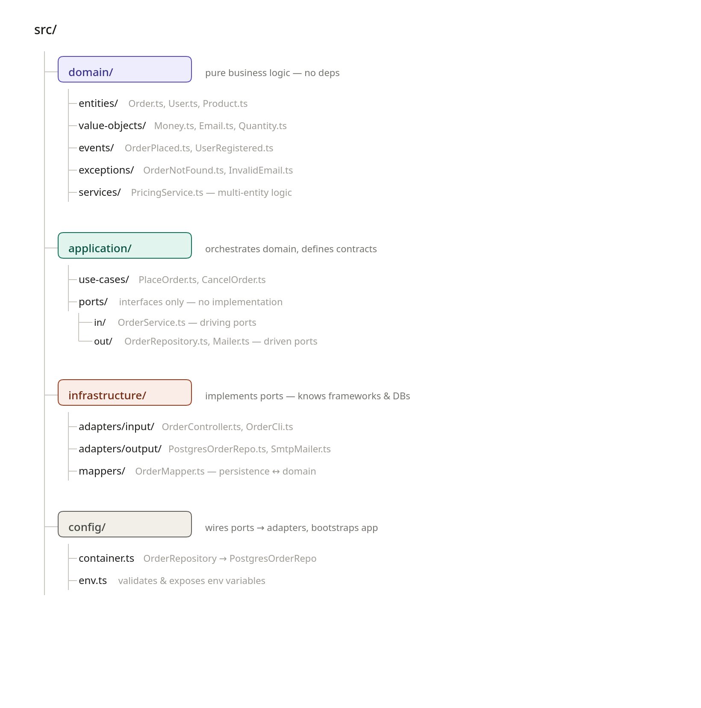

# HOW TO PROJECT WORKS

## HEXAGONAL ARCHITECTURE

This projet tend to embrace the Hexagonal Architecture pattern.

Here is a model of how should be structured files :

### WHERE WE ARE NOW

Inside API package :
 - src/adapters is the "infrastructure" layer from the model
 - src/modules is the "application" + "domain" layer from the model

#### STEP 1 : SEPARATE CONNECTIONS TO THE EXTERNAL WORLD

We are currently finishing moving out of `src/modules` everything related to the connections between the app and the external world. (HTTP, CLI, CRON, DB...)

Rename `src/adapters` into `src/infrastructure` ? Maybe overkill as we do not share mappers accross adapters.

#### STEP 2 : SEPARATE DOMAIN ONLY CODE

Put every object value (Siret, Ridet, etc), entity and exceptions into `src/domain`

#### STEP 3 : TRANSFORM SERVICES INTO USE CASES

Everything inside `src/module` should be transformed into use cases
All the shared code should be transfered to the `packages/core` to be available both for api and front apps

Rename `src/module` into `src/application`

#### STEP 4 : MAKE EVERYTHING ORCHESTRATED

Create the src/config that will configure everything together (dependance injection, app setup)